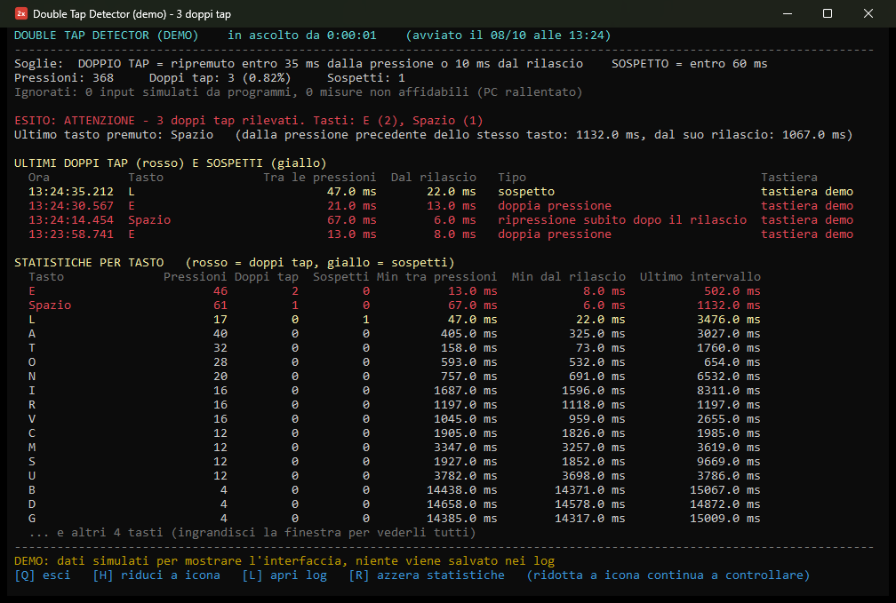
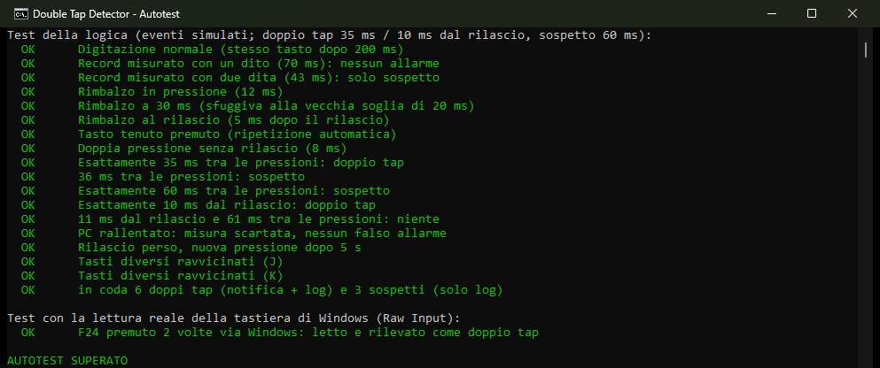

# Keyboard Double-Tap Detector

**English** | [Italiano](README.it.md)

Finds out whether your keyboard is **double tapping** (a.k.a. key chattering): one key press registered twice.
It runs quietly in the background on Windows, notifies you the moment it happens, and logs only the faulty presses.


<sub>Demo mode with simulated data (`-Demo`). The interface is in Italian.</sub>

## Why

My keyboard sometimes typed a letter twice. I wanted to know whether it was the hardware or my typing, with numbers instead of impressions.

## Thresholds, based on measurements

I first measured my own limits at full speed: **70 ms** between two presses of the same key with one finger, **43 ms** alternating two fingers, and never a re-press within 20 ms of the release. The thresholds sit below those limits:

| Level | When | What happens |
|---|---|---|
| **Double tap** | same key pressed again within **35 ms** of the previous press, or within **10 ms** of its release (release bounce) | notification + log |
| **Suspicious** | pressed again **35–60 ms** after the previous press: faster than one finger can go, so not normal typing | log and statistics only |

They can be changed at start-up with `-SogliaMs`, `-SogliaRilascioMs` and `-SogliaSospettoMs` (parameter names are in Italian).

## How it works

- Reads the keyboard **passively** through the Windows **Raw Input API** (`RegisterRawInputDevices` with `RIDEV_INPUTSINK`). It is not a keyboard hook: it cannot block, change or delay any key.
- Intervals are measured with the high-resolution performance counter, sampled as soon as `WM_INPUT` arrives.
- Each physical keyboard is tracked separately (device handle + scan code), so two keyboards don't interfere.
- **No false alarms by design:**
  - key auto-repeat (a key held down) is recognised and ignored;
  - a lost key-up (e.g. after the PC wakes from sleep) doesn't create a fake detection;
  - synthetic input from programs (password managers, macros, on-screen keyboard) is ignored;
  - if the PC was lagging and the measurement can't be trusted (the Windows message clock disagrees with the precise timer), the event is discarded instead of reported.

### Privacy

Normal key presses are **never stored anywhere**. Only double taps and suspicious presses reach the log: key name, intervals in milliseconds and keyboard ID.

## Requirements

Windows 10 or 11 with Windows PowerShell 5.1 (preinstalled). Nothing to install, no administrator rights, no registry changes.

## Quick start

1. Download or clone the repository.
2. Double-click **`Avvia.cmd`**. The window starts minimised in the taskbar, with a red **"2x"** icon in the notification area.
3. Click the icon (or the taskbar window) to see live statistics.

Want to see it first? Demo with simulated data, nothing is written to disk:

```
powershell -ExecutionPolicy Bypass -File double-tap-detector.ps1 -Demo
```

> **Windows warning:** SmartScreen or your antivirus may warn about a PowerShell script downloaded from the internet. The whole program is one readable file, `double-tap-detector.ps1`. To allow it, right-click → Properties → Unblock, or run `Unblock-File .\double-tap-detector.ps1`.

Keys in the window: `Q` quit, `H` minimise, `L` open the log folder, `R` reset statistics.

Optional start at every login: `powershell -ExecutionPolicy Bypass -File avvio-automatico.ps1` (add `-Rimuovi` to remove it). It only creates a shortcut in your Startup folder.

## Logs (`log\` folder)

- `doppi-tap.csv`: one row per double tap or suspicious press (date, time, key, intervals in ms, type, keyboard). Opens directly in Excel.
- `sessioni.log`: start and stop of each session, with a summary.

## Tests

```
powershell -ExecutionPolicy Bypass -File double-tap-detector.ps1 -Autotest
```

18 checks on the detection logic with synthetic events (exact 35/36/60 ms boundaries, release bounce, auto-repeat, lagging PC, lost key-up, different keys close together…) plus an end-to-end test that presses F24 twice through Windows and verifies it is read via Raw Input and detected.



## Built with

PowerShell and C# compiled at run time with `Add-Type`; Win32 APIs through P/Invoke (`RegisterRawInputDevices`, `GetRawInputData`, `SendInput`); Windows Forms for the tray icon and notifications. Single file, no dependencies.

## License

[MIT](LICENSE)
